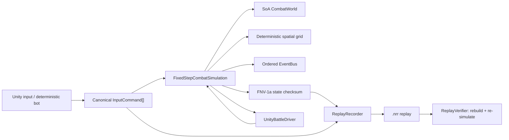

# Nebula Raid：确定性 Unity 客户端工程样例

这是一个面向 Unity 客户端岗位的可运行工程样例。它没有把复杂度藏在演示场景里，而是把战斗、回放、缓存和热更新安全边界放进同一份 `netstandard2.1` 纯 C# 核心：Unity 通过 `asmdef` 引用它，Console、测试和基准也直接编译这份源码。

当前仓库包含 Unity 2022.3-ready 目录结构，但本机验证覆盖的是 `.NET` 核心、Console 演示、行为测试和微基准；没有声称已在 Unity Editor/Player 内完成打包验证。

## 能看到什么

| 模块 | 实现与可验证证据 |
|---|---|
| ECS-lite 战斗 | 组件采用 SoA 稠密数组；固定 30 Hz、整数毫米坐标、稳定实体 ID、同 tick 伤害延迟结算 |
| 空间查询 | 可复用的 uniform grid；桶按实体 ID 写入，查询按固定坐标顺序，不依赖字典遍历顺序 |
| 回放 | 记录每 tick 输入与 64-bit 状态校验和；严格文本编解码；可定位首个不一致 tick |
| 客户端基础设施 | 有序同步事件总线、带统计的有界对象池、引用计数 + weighted LRU 资源缓存、并发加载合并 |
| Lua 更新边界 | 严格 JSON manifest、路径/扩展名/大小/SHA-256/符号链接校验、staging 二次校验、运行时探针、原子版本指针与 last-known-good 回滚 |
| 工程质量 | 无第三方测试依赖的 10 项行为测试、Console demo、预热后微基准、Windows/Linux CI |

核心入口：

- `Assets/Scripts/NebulaRaid/Core/Combat/FixedStepCombatSimulation.cs`
- `Assets/Scripts/NebulaRaid/Core/Replay/ReplayVerifier.cs`
- `Assets/Scripts/NebulaRaid/Core/Resources/ReferenceCountedResourceCache.cs`
- `Assets/Scripts/NebulaRaid/Core/HotUpdate/HotUpdateReleaseStore.cs`

## 快速运行

需要 .NET 8 SDK 或更高版本。仓库没有 NuGet 第三方包。

```powershell
dotnet build NebulaRaid.sln -c Release
dotnet run --project tests/NebulaRaid.Tests/NebulaRaid.Tests.csproj -c Release --no-build
dotnet run --project src/NebulaRaid.Demo/NebulaRaid.Demo.csproj -c Release --no-build
dotnet run --project benchmarks/NebulaRaid.Benchmarks/NebulaRaid.Benchmarks.csproj -c Release --no-build -- --entities 1024 --ticks 300
```

Windows 也可直接运行：

```powershell
./scripts/verify.ps1
```

Demo 会生成 `.artifacts/demo/last-match.nrr`，随后重新解析并从零执行回放。成功输出应包含 `verify=PASS`；篡改任一帧校验和会在测试中被检出。

## 架构



关键确定性约束：

1. 权威状态只使用整数；Unity `Vector3` 仅做渲染插值，不写回战斗。
2. 命令必须按实体 ID 升序、每实体每 tick 最多一条，不符合即拒绝。
3. 目标选择按距离、再按实体 ID 打破平局。
4. 攻击先规划、后统一扣血，使同 tick 对攻不受循环先后影响。
5. 校验和按固定字段、固定小端字节顺序写入 FNV-1a。

更完整的设计说明见 [docs/architecture.md](docs/architecture.md) 和 [docs/replay-format.md](docs/replay-format.md)。

## Unity 接入

1. 用 Unity Hub 打开仓库根目录；版本记录为 `2022.3.62f1`。
2. `NebulaRaid.Core.asmdef` 设置 `noEngineReferences: true`；Unity 和 .NET 工程共同使用 `Assets/Scripts/NebulaRaid/Core` 下的源码。
3. 在空 GameObject 上挂 `UnityBattleDriver`，创建并绑定 8 个 actor Transform，即可由 sample bot 驱动战斗并平滑插值。
4. 实际项目中，把 `DeterministicBot` 替换为输入采样/网络帧缓冲；保持 `InputCommand` 的 tick 与排序约束。
5. `UnityResourcesLoader<T>` 是 `Resources.LoadAsync` 适配示例。生产项目可用相同接口接 Addressables，并把估算内存传给 weighted LRU。

`UnityBattleDriver` 是接入示例，不是完整游戏场景；仓库没有提交二进制贴图、模型或预制体。

## Lua 热更新：明确的安全边界

仓库**没有集成或冒充集成 xLua/ToLua，也没有内置 Lua VM**。`ILuaRuntimeProbe` 是真实运行时的适配边界，`MissingLuaRuntimeProbe` 默认拒绝激活，做到 fail closed。

已实现：

- manifest 严格字段与整数 JSON 解析，拒绝重复/未知字段；
- 仅允许规范化相对 `.lua` 路径，拒绝 `..`、反斜杠、绝对路径和 reparse point；
- 单文件/总包大小上限、大小与 SHA-256 流式校验、入口文件必须在清单中；
- 复制到 staging 后再次校验；
- 运行时探针成功后才原子切换 `active.version`；
- 保存 `last-known-good.version`，回滚前重新校验并再次探针。

SHA-256 只能发现损坏或“清单与文件不一致”，不能证明发布者身份。生产发布还必须增加离线私钥签名（例如 Ed25519）、密钥轮换、服务端防降级策略和受限 Lua API。详见 [docs/hot-update-boundary.md](docs/hot-update-boundary.md)。

## 性能方法与一次真实结果

基准先在同一模拟中预热 20 tick，再强制 GC，计时范围只包含 `Step`；场景为 1,024 个成对实体，每 tick 发起攻击，命令数组和场景在计时前分配。它不是 Unity Player、渲染或网络基准。

在 Windows 10、.NET 8.0.22、当前开发机上运行 1,024 实体 × 300 measured ticks：

```text
elapsedMs=493.716
ticksPerSecond=607.6
actorStepsPerSecond=622220
measuredThreadAllocBytes=40
gen0Collections=0
checksum=0x4CE7C786C41AA34A
```

`40 bytes` 是该次进程内测量值，不等于“所有平台绝对零 GC”；事件总线有订阅者时为支持订阅期间安全变更，会为发布快照分配数组。请在目标 Unity Player、IL2CPP、真机和真实资源规模下重新采样。复现实验与解读见 [docs/performance.md](docs/performance.md)。

## 面试可讲的设计取舍

- 为什么权威模拟不用 `float`，以及“确定性”还需要输入规范化、遍历顺序和校验和共同保证。
- 为什么同时伤害要分成 plan/resolve 两阶段，以及它如何消除先遍历者优势。
- 为什么缓存“有引用时不能淘汰”，并发 miss 如何合并为一份加载任务，weighted LRU 如何处理超预算大资源。
- 为什么文件哈希不等于可信发布，staging、运行时探针、原子指针和 last-known-good 分别解决哪类失败。
- 如何用 golden checksum、回放篡改测试与跨 OS CI 发现确定性漂移。

## 已知限制

- 没有网络同步、预测回滚、服务端权威或反作弊；当前回放是本地确定性验证。
- 没有真实 Lua VM；示例 Lua 不会被本仓库执行。
- 没有 manifest 数字签名、防降级服务或下载器；不能直接作为生产热更系统。
- ECS-lite 使用托管数组和字典空间网格，不是 Unity Entities/DOTS，也没有 Burst/Jobs。
- Console 微基准不含渲染、物理、音频、资源反序列化和 Unity 主线程开销。
- 当前环境未安装 Unity Editor，因此未执行 Unity 场景/Player 构建；CI 验证的是共享纯 C# 核心。

## 目录

```text
Assets/Scripts/NebulaRaid/Core/       Unity 与 .NET 共用核心
Assets/Scripts/NebulaRaid/Unity/      Unity 渲染/资源适配
Assets/StreamingAssets/HotUpdateSamples/
src/NebulaRaid.Demo/                  Console 端到端演示
tests/NebulaRaid.Tests/               无测试框架依赖的行为测试
benchmarks/NebulaRaid.Benchmarks/     可复现微基准入口
docs/                                 架构、回放、热更和性能说明
.github/workflows/ci.yml              Windows/Linux CI
```

MIT License。
