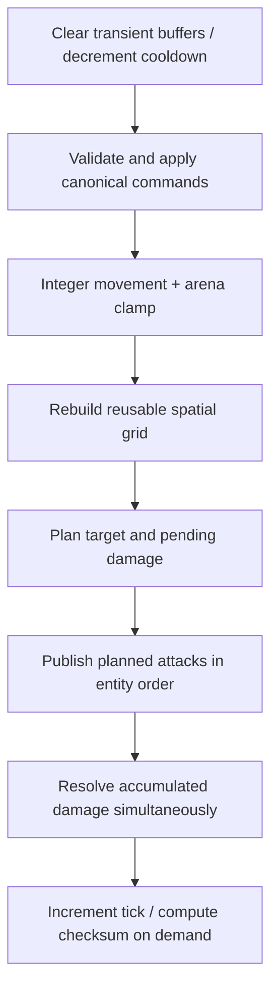

# 架构与确定性约束

## 分层

`NebulaRaid.Core` 目标框架为 `netstandard2.1`，不引用 `UnityEngine`。SDK 项目通过 glob 直接编译 `Assets/Scripts/NebulaRaid/Core/**/*.cs`，Unity 则通过 `NebulaRaid.Core.asmdef` 编译同一批文件。这样 Console 测试通过的逻辑就是进入 Unity 的逻辑。

Unity 层目前只有三个薄适配：

- `UnityBattleDriver`：累计真实时间、按固定步长推进、把整数毫米状态转换成只读渲染位置并插值；
- `UnityResourcesLoader<T>`：把 `Resources.LoadAsync` 接到核心资源接口；
- `MissingLuaRuntimeProbe`：在没有 Lua VM 时拒绝激活，不允许“验证完文件就假定脚本能运行”。

## ECS-lite 数据布局

实体 ID 是从 0 开始的稳定数组索引。`CombatWorld` 没有为 actor 创建组件对象，而是保存：

```text
Alive[] Team[] PositionX[] PositionY[] Health[]
Speed[] Damage[] AttackRange[] Cooldown[] MoveX[] MoveY[]
```

优点是顺序访问、低对象数量、天然稳定遍历；代价是动态增删与 archetype 迁移能力有限。该设计用于展示数据导向思路，并不声称替代 Unity Entities。

每 tick 管线：



## 确定性不是一个数据类型

整数坐标只解决浮点跨平台差异的一部分。实现还显式固定：

- 输入 tick、唯一性和实体 ID 排序；
- actor 遍历顺序；
- uniform grid 的 cell 查询顺序与 bucket 插入顺序；
- 最近目标距离相等时的实体 ID tie-break；
- 同 tick 伤害的提交阶段；
- checksum 字段顺序和字节顺序。

字典只用于按明确 key 查 bucket，从不枚举字典来决定游戏结果。

## 事件、池和资源生命周期

`EventBus` 同步发布，handler 顺序等于订阅顺序。它在发布前复制订阅快照，允许 handler 取消订阅而不破坏当前遍历；这是明确的分配换语义选择。高频视觉事件在真实 Unity 项目中可进一步换成定长 ring buffer。

`ObjectPool<T>` 是有界 LIFO 池，reset 在入池时执行，并暴露 created/rented/returned/dropped 指标。池只优化生命周期已被证明频繁的短命对象，不改变所有权。

`ReferenceCountedResourceCache<T>` 的状态规则：

- 第一个 miss 创建共享 loading task；
- 后续同 key acquire 增加引用并等待同一 task；
- 引用大于 0 的 entry 被 pin，绝不淘汰；
- 引用归零后进入 idle LRU；
- resident weight 超预算时，从最久未使用的 idle entry 开始淘汰。

取消某个 acquire 不会中断已共享的底层加载；共享任务完成后，该 acquire 释放自己的引用再报告取消。

## 可继续演进

- 将命令缓冲改为预分配 ring buffer，减少 demo bot 的数组分配；
- 将空间网格从 `Dictionary<long, List<int>>` 换为预分配开放寻址表；
- 增加 snapshot + input history，形成客户端预测与 rollback；
- 在 Unity Profiler/ProfilerRecorder 下分离主线程、渲染线程、GC 和资源 IO；
- 给事件总线增加无分配 typed channel，用于每帧大量战斗表现事件。

