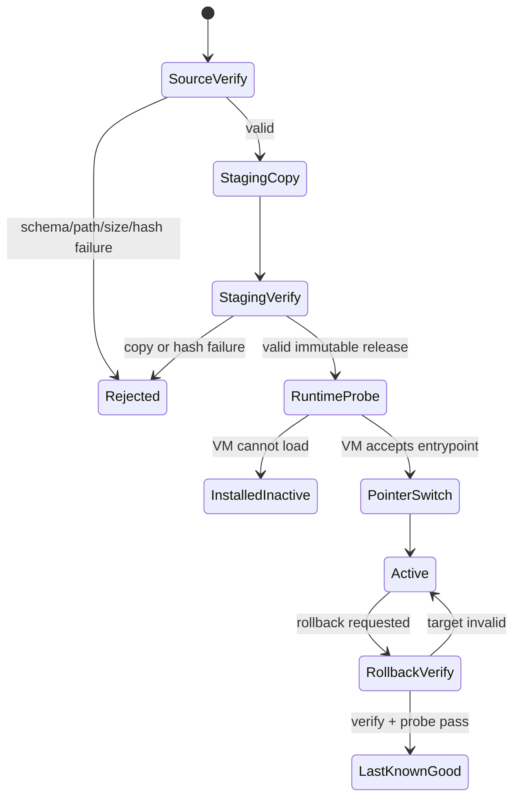

# Lua 更新包边界与回滚

## 目标与非目标

这里实现的是“在把文件交给 Lua VM 之前和切换版本指针时，客户端必须守住什么边界”。仓库没有 Lua VM，不执行脚本，也不宣称集成 xLua。`ILuaRuntimeProbe` 必须由宿主项目在完成真实 VM 初始化、模块加载和受限 API 注入后实现。

## Manifest

固定 schema：

```json
{
  "schemaVersion": 1,
  "bundleVersion": "1.1.0",
  "minimumAppVersion": "1.0.0",
  "entrypoint": "main.lua",
  "files": [
    {
      "path": "main.lua",
      "sha256": "64 hex chars",
      "size": 238
    }
  ]
}
```

解析器拒绝未知字段、缺失字段、重复 key、浮点数、非法 surrogate、过深嵌套和尾随内容。验证器进一步限制文件数、单文件大小、总大小、版本兼容性和入口存在性。

路径只允许 `/` 分隔的相对 `.lua` 文件。绝对路径、`..`、`.`、空 segment、反斜杠、冒号和 reparse point 都被拒绝。路径在访问前执行 `GetFullPath` 并确认仍位于 package root。

## 激活状态机



`active.version` 通过同目录临时文件和 `File.Replace`/`File.Move` 切换。切换新版本前保存原值到 `last-known-good.version`。回滚不是盲目改指针：目标 release 会重新执行 manifest/文件校验和 runtime probe。

## 威胁模型与缺口

当前 SHA-256 能发现传输损坏、磁盘修改和 manifest/file 不匹配；如果攻击者能同时替换 manifest 和 Lua，哈希不能提供发布者身份。

生产化还必须加入：

- 对 canonical manifest 做离线私钥签名，客户端只内置公钥；
- key id、密钥轮换与吊销；
- 服务端 monotonic version / 安全例外清单，防止合法旧包降级；
- TLS、下载临时目录配额、超时、重试与断点续传；
- Lua sandbox、API allowlist、CPU/内存预算和错误熔断；
- 更新审计、灰度、崩溃率监控和远程 kill switch。

示例包位于 `Assets/StreamingAssets/HotUpdateSamples`，CI 会重新计算大小与 SHA-256。它们只说明包约定，不会被本仓库执行。

