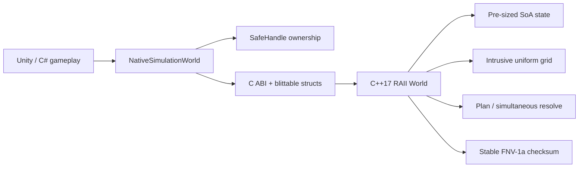

# C++17 原生模拟与 Unity P/Invoke 边界

## 目标与边界

`native/` 是一个自包含的 C++17 项目实践：用稳定 C ABI 暴露确定性战斗步进，C# 侧通过 `DllImport` 与 `SafeHandle` 管理生命周期。它用于展示原生数据布局、跨语言所有权和可验证性能方法，不声称替代仓库里的完整 C# 客户端核心，也不声称已经在 Unity Player/IL2CPP 真机完成打包验证。

原生模块只接受定长 POD 结构，不跨 ABI 传递 STL、异常、引用或 C++ 对象：



## 原生架构

- `NebulaNativeWorld` 在构造时一次性分配权威状态和 scratch buffer，析构时由 `std::vector` RAII 自动释放；`step` 只覆盖和复用这些缓冲，不增长容器。
- actor 状态使用 SoA：存活、队伍、坐标、生命、速度、伤害、射程和冷却分别连续存储。
- uniform grid 使用 `cell_head[] + next_in_cell[]` 侵入式链表；按 actor ID 逆序插入，保证 bucket 内升序遍历，不依赖哈希表枚举顺序。
- 命令必须与当前 tick 一致、actor ID 严格升序且每 actor 最多一条；整帧先验证再修改，因此拒绝非法命令时状态和 checksum 不变。
- 攻击分成 plan/resolve 两阶段。所有伤害先累积，再统一扣血，避免同 tick 先遍历者获得生存优势。
- checksum 按固定字段和小端字节顺序写入 FNV-1a，测试用两次独立世界重放同一输入验证一致性。

入口：

- C ABI：`native/include/nebula_native.h`
- C++ 实现：`native/src/nebula_native.cpp`
- Unity/C# 门面：`Assets/Scripts/NebulaRaid/Unity/NativeSimulationBridge.cs`
- C++ 行为测试：`native/tests/native_tests.cpp`
- 真实托管互操作测试：`tests/NebulaRaid.NativeInterop.Tests/Program.cs`

## Windows 本机构建与验证

要求 Visual Studio Build Tools 的 MSVC x64 C++ 工具链和 .NET 8 SDK。脚本通过 `vswhere` 定位工具链，不要求预先打开 Developer PowerShell：

```powershell
./scripts/verify-native.ps1
```

脚本依次：

1. 以 `/std:c++17 /permissive- /W4 /WX /O2` 构建 `NebulaNative.dll`；
2. 运行 4 条原生行为测试；
3. 运行真实 `C# -> DllImport -> C ABI -> C++` 往返测试；
4. 运行 4,096 actor × 500 measured tick 微基准。

仓库同时提供 `native/CMakeLists.txt`，CI 在 Windows 和 Linux 上构建共享库、运行 CTest、benchmark smoke test，并分别加载 `NebulaNative.dll` / `libNebulaNative.so` 执行托管互操作。

## Unity 接入

Windows x86_64 示例：

1. 运行 `verify-native.ps1`；
2. 将 `.artifacts/native/NebulaNative.dll` 复制到 Unity 工程的 `Assets/Plugins/x86_64/`；
3. 在 Inspector 为插件选择目标平台和 CPU；
4. 用 `NativeSimulationWorld` 创建世界，按 actor ID 升序提交 `NativeCommand[]`；
5. 构建前为目标平台单独编译共享库，并在 Player/IL2CPP 与真机上重跑 profile。

仓库不提交本机构建出的 DLL。C ABI 当前版本为 1；改变结构布局或函数语义时必须升级 ABI 版本并保留兼容策略。iOS 静态链接使用 `__Internal` 名称，但当前仓库没有 iOS 工具链验证。

## 当前机器的一次真实结果

2026-07-29，Windows 10、MSVC 19.50.35720、Release x64：

```text
native C++ tests: 4/4 PASS
C# P/Invoke roundtrip: PASS
entities=4096; warmupTicks=20; measuredTicks=500
elapsedMs=403.141
ticksPerSecond=1240.3
actorStepsPerSecond=5080105
attacksResolved=2129920
checksum=0xB037CC58201CBA54
```

计时只覆盖原生 `nebula_world_step`，命令数组、世界创建、actor spawn 和 SoA/grid buffer 分配均在计时外。该结果不是 Unity Player 帧率，也没有测量渲染、脚本到原生调用封送、音频、物理或网络开销；简历只能写成“本机 C++ 微基准”，目标平台必须重新采样。
